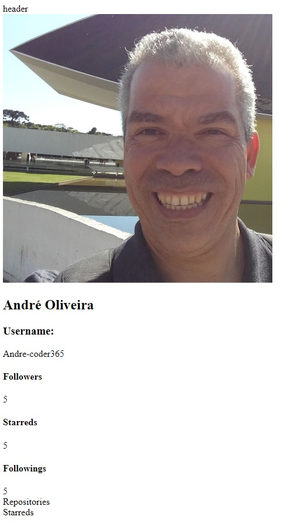

# :atom_symbol: Desafio de projeto REACT DIO - TQI

##### Neste desafio do Bootcamp TQI FullStackDeveloper eu estou desenvolvendo a criação de um front-end totalmente componentizado na prática com React-JS.

Nesse app é possível acessar uma página no navegador e pesquisar por usuários do Github. O resultado apresenta dados públicos de usuários do Github relacionados com o nome apresentado na pesquisa.

#### Bibliotecas usadas:

- Axios
- styled-components (https://styled-components.com/docs/basics#installation)

#### No commit inicial, o código está gerando no navegador o resultado da imagem abaixo:

